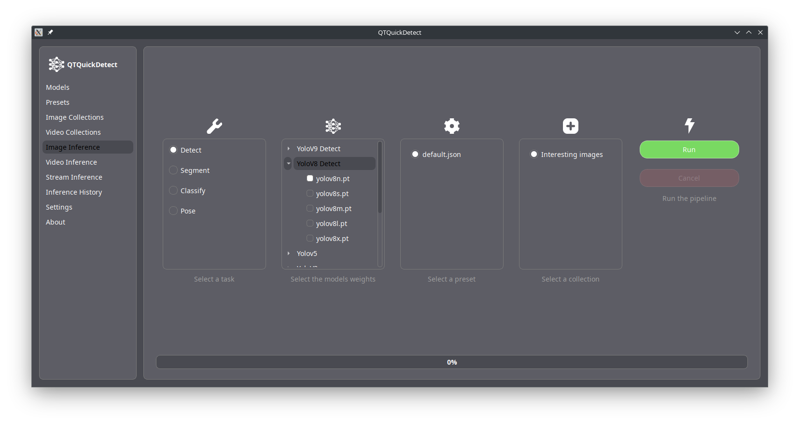

# QTQuickDetect



QTQuickDetect is a powerful application designed to compare and evaluate the performance of different deep learning models for object detection, segmentation, classification, and pose estimation. This user-friendly tool allows you to analyze images, videos, and live streams with ease, providing detailed results and history for each task.

## Features

QTQuickDetect offers a wide range of functionalities:

- **Inference on Images, Videos, and Live Streams**: Analyze different media types with ease.
- **Multiple Task Support**: Choose between detection, segmentation, classification, and pose estimation.
- **Customizable Settings**: Configure inference settings including device, precision, and color preferences.
- **Media Management**: Organize and manage your image and video collections efficiently.
- **Detailed Results and History**: View and save inference results in various formats and access previous analyses.
- **Data Export**: Export results in JSON format for further analysis or integration with other tools.

## Tasks

QTQuickDetect can perform the following tasks:

- **Detection**: Identify and locate objects within an image or video with bounding boxes. [More info](https://docs.ultralytics.com/tasks/detect/)
- **Segmentation**: Classify each pixel to determine the exact shape and boundary of objects. [More info](https://docs.ultralytics.com/tasks/segment/)
- **Classification**: Assign labels to an entire image or specific regions with confidence scores. [More info](https://docs.ultralytics.com/tasks/classify/)
- **Pose Estimation**: Detect key points on objects, commonly used for human pose estimation. [More info](https://docs.ultralytics.com/tasks/pose/)

## Inference Output

Each inference task generates comprehensive results, including:

- Processed media (images or videos) annotated with bounding boxes, segmentation masks, etc, for visualization.
- A JSON file with detailed information about each detected object, such as class labels, confidence scores, and coordinates.

## Installation

Qtquickdetect has been tested on both Windows and Linux, with Python 3.10, 3.11 and 3.12. MacOS is currently not supported.

In order to use QTQuickDetect, you may simply `pip install` the software to your python environement.

Sample usage (if you are using [conda](https://docs.conda.io/en/latest/)):

```bash
conda create -n qtquickdetect python=3.10
conda activate qtquickdetect
<acquire a copy of qtquickdetect and navigate to its folder>
pip install .
```

You may also install the test dependencies by activating the `test` extra.

### Important notes for GPU acceleration

GPU acceleration is supported for Nvidia users. Please install CUDA-enabled `torch 2.3.x` and `torchvision 0.18.x`, as per the instructions on the [PyTorch website](https://pytorch.org/get-started/locally/). You may install the GPU-enabled torch builds before or after installing QTQuickDetect.

You will then have access to the device selection dropdown in the presets tab.

## Authors

QTQuickDetect was developed by Jean-Loup Mellion and Gatien Da Rocha, students at the University IUT Vannes, France.
