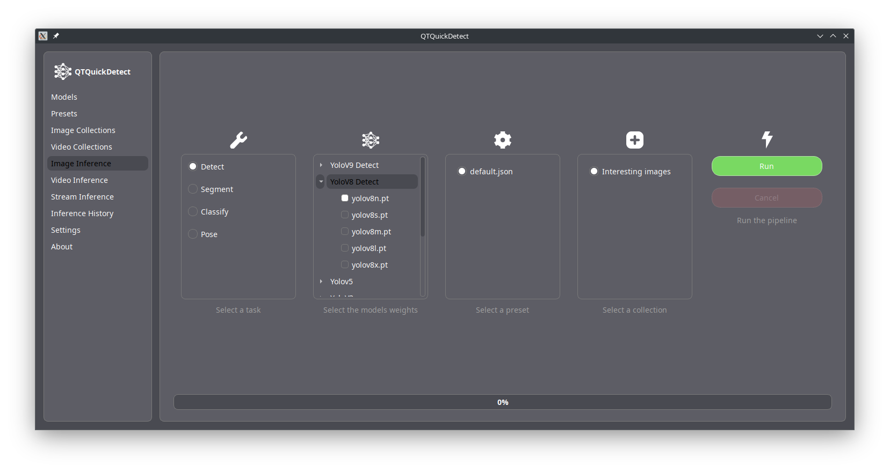

# QTQuickDetect

QTQuickDetect is a powerful application designed to compare and evaluate the performance of different deep learning models for object detection, segmentation, classification, and pose estimation. This user-friendly tool allows you to analyze images, videos, and live streams with ease, providing detailed results and history for each task.

## Overview

QTQuickDetect leverages state-of-the-art deep learning models to provide comprehensive analysis capabilities for various media types. Whether you're working with images, videos, or live streams, our application offers a seamless experience for tasks such as object detection, segmentation, classification, and pose estimation.

[Get started with QTQuickDetect](installation.md)