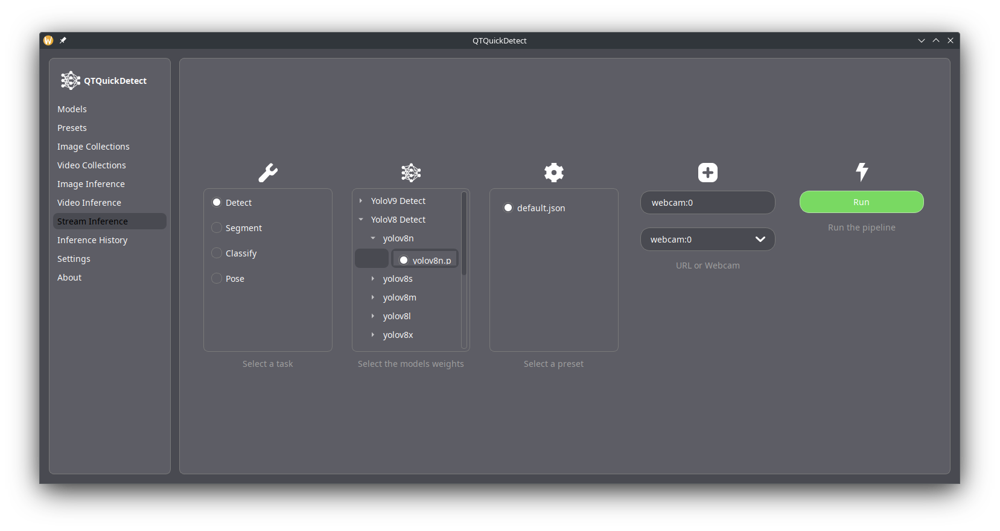

# How to Use

Upon launching QTQuickDetect, you will be met with the "About" page, containing information about the software and its authors.

We highly recommend you read most of its contents, as it contains useful information.

## Models tab

The models tab is where you can manage available models. You can inspect supported model families, and tasks, and manage custom weights.
If you want custom weights for the yolo family of models, there are quite a few available over at [Roboflow universe](https://universe.roboflow.com/).

## Presets tab

In QTQuickDetect, presets are a way to save a set of configurations. You can create presets and rename them to your liking.

### Available settings

**Device** : Allows you to select a GPU to use (if available) or use the CPU.

**Half Precision** : Will lower the model precision to half-precision (fp16) if available. This has a negligible impact on accuracy, but can significantly speed up inference.

**IOU Threshold** : The Intersection over Union threshold to use for object detection. This controls how boxes are merged together for some models. Higher values will result in fewer boxes, but may miss some objects. Lower values will result in more boxes, but may have more false positives (e.g. multiple boxes for the same object).

**Image Format** : The format to export the images in. 

**Video Format** : The format to export the video in.

**Box Color** : The color of the bounding boxes.

**Random Box Color by Class** : If enabled, the bounding boxes will be colored based on the class of the object, instead of a single color.

**Segment Color** : The color of the segmentation mask.

**Random Segment Color by Class** : If enabled, the segmentation mask will be colored based on the class of the object, instead of a single color.

**Text Color** : Text color for any text drawn on the image.

**Box Thickness** : The thickness of the bounding boxes. Varies depending on image resolution, this might need to be adjusted according to the quality of your images.

**Segment Thickness** : The thickness of the segmentation mask's outline (also varies depending on image resolution).

**Text Size** : The size of the text drawn on the image (also varies depending on image resolution).

**Pose ... Color** : The color to use for different limbs detected by pose estimation models.

**Pose Point Size** : The size of the points drawn by pose estimation models (varies depending on image resolution). Points are usually drawn at the joints of the detected pose.

**Pose Line Thickness** : The thickness of the lines drawn by pose estimation models (varies depending on image resolution). Lines are usually drawn between the joints of the detected pose.

# Image/Video Collections tab

The Image/Video Collections tab is where you can manage your media collections. You can add, remove, and inspect images and videos. A collection is then used for inference, meaning all the media in the collection will be processed.

# Image/Videos Inference tab

Once you are happy with your settings, and have created a collection, you can start inference. The inference tab will have you select a task (detection, segmentation, classification, or pose estimation), one or multiple models, and a collection to process.

# Stream Inference tab

Just like the Image/Video Inference tab, but for live streams. You can select a task, a __single__ model, a preset, and a stream source (URL, or webcam). You will then be met with a window showing the stream and the inference results in real-time.

# Inference History tab

You can view the results of previous inferences here. You can also export the results in JSON format for further analysis or integration with other tools.

# Settings tab

If you wish to change the default language, or the theme, you can do so in the settings tab. If necessary, you can also reset the software to its default settings, or manually edit the configuration file.